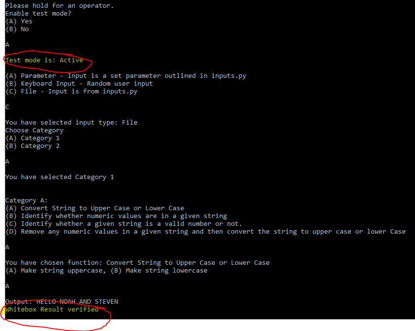

# ISAD Final Assessment
## Student ID: 21042449
## NoahEdge_21042449_Report

## Features
- Rudimentary GUI to navigate
- Three different input methods: parameter, keyboard input, file
- Converts a given string to upper case or lower case. 
- Identifies whether numeric values are in a given string.
- Identifies whether a given string is a valid number or not.
- Removes any numeric values in a given string and then converts the string to upper case or lower case.

## Module descriptions

## main.py
As a part of this assessment I have created a menu. This menu allows users to select one of three methods of input:

- Parameter - Input is a set parameter outlined in inputs.py
- Keyboard Input - Random user input with the keyboard
- File - Input is from inputs.py

Once users have selected an input method, they are prompted to select once of the two function 'categories' outlined in the assignment specification. Once one of these functions have been selected, function and input method options will arrise. 

For example, if you select function B from category B you'll be prompted to select between meter/feet conversions, or centimeter/inches conversions. If for example meters/feet is selected (A) you will be prompted on whether you'd like to convert meters into feet, or vice versa.

Once A has been selected, your input method will be checked. If you have selected parameter or file inputs you'll default to the file default (in this case 42). If you have selected keyboard input, the user will be prompted to enter text.

The result of the parameter input will be 137.802 feet, as the default meter count is 42 meters. Depending on what is typed in the keyboard input, an infinite variety of outputs can be derived. If the entered string cannot be converted into a float value for calculation, it'll automatically return as an error.

## inputs.py

### convertNumbers.py
Contains category 2 functions that deal primarily with numerical strings. These include:

#### Function A:
- metersFeet
- centimetersInches
#### Function B:
- kilosPounds
- miligramsOunces
#### Function C: 
- hoursMinutes
- minutesSeconds
#### Example: metersFeet Function
EXAMPLE THIS ^

### manipulateStrings
This module contains functions that're used in Category 1 manipulation of strings
#### Function A:
- changeCaseUp: Changes all characters to upper case

- changeCaseDown: Changes all characters to lower case
#### Function B:
- indentifyNumerals: will return a true or false, depending on whether there are numerals in the string
- 
#### Function C: 
- validNumber: Checks if the string is a valid number. Valid numbers for my function include 1, 2, 3...

#### Function D: 
- Deenz - Function D removes any numeric values in a given string and then convert the string to upper case or lower Case
### Example: Deenz Function
In this instance I entered: alakf5321j11HODL as an example of the expected output

## Modularity

### Implementation

##### Black Box Testing:
Black Box testing

##### Self-Diagnostic Code
In order to test the code created, users can enabled 'Test Mode' which is avaliable by selecting A with the first option in the menu. This mode will independently verify results with the expected result.

## Review Checklist:
User can navigate to each of the function options: Yes
User can enable test mode from inside the software:

This piece of software is bad. And here's why:
review checklist
you have created, results of conducting the review using the review checklist with explanation
on your results and how you have addressed any issues

## Whitebox/Blackbox Example. Category 1 Function 1:

### WHITEBOX

Look at your code implemented above and identify at least two modules where white-box
testing approach will be beneficial. Design test cases to cover functionality of the selected
modules using white-box testing approach. Indicate clearly which modules are tested with
white-box approach.

### BLACKBOX

Based on the module descriptions written by you in part 2 above (OR the revised version
after refactoring in Part 3 above, if any revision is done), design suitable test cases using:
a. equivalence partitioning.
b. boundary value analysis.
You may design test cases using both above approaches for all the modules you have
defined OR you can use Equivalence partitioning for some modules and Boundary value
analysis for other modules. Mention clearly which approach is used in each test design.

## Code Tests

### How to access these test commands and what they do

Implement your test designs for part 4 and part 5 above using either Python or Java. Using a
unit test framework is optional.
Run your test case and obtain results. Identify any test failures and then try to improve your
code. 

vv

## Results of these tests

## Ethics
Ethics and Professionalism [15 Marks]
Think about a scenario the code you have designed can be used in a large software
project.
a. Discuss how lack of ethical and professionalism can result in harmful effects using
the code you have designed and implemented. You may refer to lecture 9, seven
points useful in identifying ethical issues, as a guidance.
b. Using ACS or IEEE-CS Ethical guidelines, give two suggestions to avoid ethical and
professional issues in your software proposed in this assignment. 