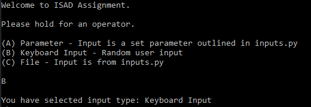
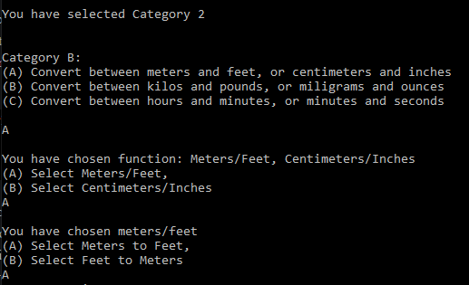
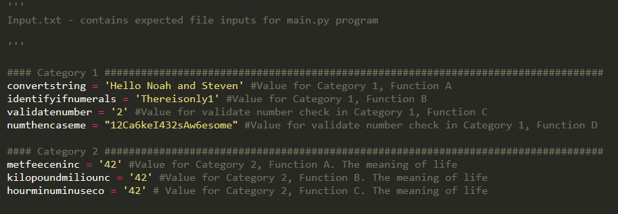
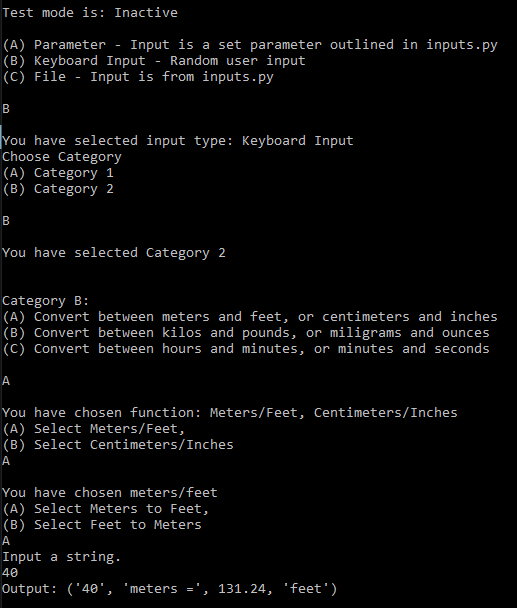
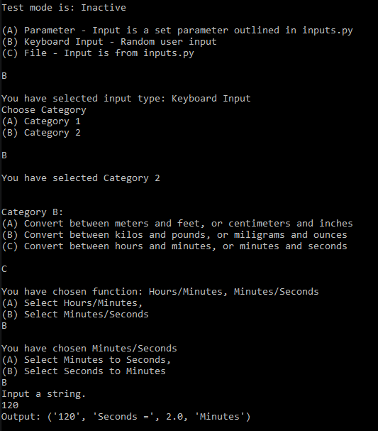
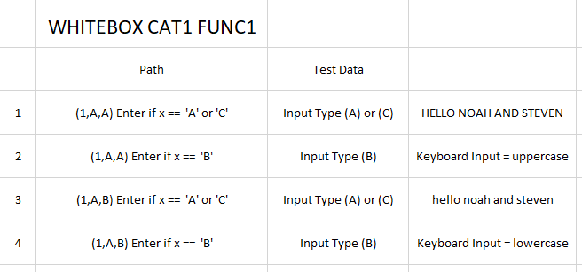

# ISAD Final Assessment
## Student ID: 21042449
## NoahEdge_21042449_Report

## Features
- Text-based menu GUI to navigate to test mode, input type and functions
- Three different input methods: parameter, keyboard input, file
- Converts a given string to upper case or lower case. 
- Identifies whether numeric values are in a given string.
- Identifies whether a given string is a valid number or not.
- Removes any numeric values in a given string and then converts the string to upper case or lower case.

## Module descriptions

## main.py
As a part of this assessment I have created a menu. 

The first part of this menu offers to option to go into test mode. Test mode will verify results outputted by the program in a message reading 'Whitebox Results Verified.'

This menu allows users to select one of three methods of input:

- Parameter - Input is a set parameter outlined in inputs.py
- Keyboard Input - Random user input with the keyboard
- File - Input is from inputs.py

Once users have selected an input method, they are prompted to select once of the two function 'categories' outlined in the assignment specification. Once one of these functions have been selected, function and input method options will arrise. 

For example, if you select function B from category B you'll be prompted to select between meter/feet conversions, or centimeter/inches conversions. If for example meters/feet is selected (A) you will be prompted on whether you'd like to convert meters into feet, or vice versa.

Once A has been selected, your input method will be checked. If you have selected parameter or file inputs you'll default to the file default (in this case 42). If you have selected keyboard input, the user will be prompted to enter text.

The result of the parameter input will be 137.802 feet, as the default meter count is 42 meters. Depending on what is typed in the keyboard input, an infinite variety of outputs can be derived. If the entered string cannot be converted into a float value for calculation, it'll automatically return as an error.

## inputs.py

### convertNumbers.py - (found in main.py)
Contains category 2 functions that deal primarily with numerical strings. These include:
#### Function A:
- metersFeet: Converts Meters to Feet and vice versa
- ### EXAMPLE

- centimetersInches: Converts centimeters to inches and vice versa
#### Function B:
- kilosPounds: Converts kilos to pounds and vice versa
- miligramsOunces: Converts miligrams to ounces and vice versa
#### Function C: 
- hoursMinutes: Converts hours to minutes and vice versa
- minutesSeconds: Converts minutes to seconds and vice versa

### manipulateStrings.py - (found in main.py)
This module contains functions that're used in Category 1 manipulation of strings. These include:
#### Function A:
- changeCaseUp: Changes all characters to upper case

- changeCaseDown: Changes all characters to lower case
#### Function B:
- indentifyNumerals: will return a true or false, depending on whether there are numerals in the string
- 
#### Function C: 
- validNumber: Checks if the string is a valid number. Valid numbers for my function include 1, 2, 3...

#### Function D: 
- Deenz - Function D removes any numeric values in a given string and then convert the string to upper case or lower Case
### Example: Deenz Function
In this instance I entered: alakf5321j11HODL as an example of the expected output

## Modularity

### Implementation

## Black Box Testing:
#### Boundary Value & Equivalence Partitioning Analysis Table:

##### How to Access Test Commands and what they do
In order to test the code created, users can enabled 'Test Mode' which is avaliable by selecting A with the first option in the menu. This mode will independently verify results with the expected result.

## Whitebox Examples

### WHITEBOX

Whitebox would be useful in making sure the paths to my functions are all fully functional and able to be accessed. Here are two examples:

- The first is category 1, function1 (manipulateStrings.py module). In this function it'd be beneficial to use whitebox as it allows me to determine whether the code is correctly dealing with the input type. If the result does not contain characters found in 'Hello Noah and Steven' it's clearly drawing from the keyboard input and correct.

- In the second, I'd look at category 2(convertNumbers.py), function1. In this function it'd be beneficial to use whitebox as it allows me to determine whether the code is correctly dealing with the input type. If the result does not compute (with the keyboard option) or equal to these outputs if it's drawing from file.

## Review Checklist:
- User can navigate to each of the function options: Yes
- User can enable test mode from inside the software: Yes
- User can select an input mode, that will apply to the selected function: Yes
- Functions have been separated out into the module files: No. In order to achieve this, I'd simply take the code out of main.py and transfer it over to the appropriate module
- Main.py contains limited duplicate code: No
- Software contains limited global variables: No, contains many. But rarely travels across modules

## Ethics

I could see this software being used in perhaps a timer app. Using Category 2, Function C (Time Functions) a user could input their desired timer time in seconds, or even hours. 

However, if my code lacks professionalism it can falter and cause adverse and harmful impacts. For example, someone who could've relied on my software to know when to head to work, or a feed a child. They could lose their job afer being late, or the baby could be fed late, simply because I didn't implement an error message that indicating an invalid value entered. Or, even, having the options by A and B, they're so similar - and may lead someone to accidently use the wrong function.

Another example of an ethical consideration would be overpromising. In creating this software, I have stated that it will accurately convert feet to meters, and ounces to miligrams. However, it is important to consider that I have only accounted for accuracy up to two decimal points. As the calculations are done on floating point variables, there are inevitable errors that will eventually crop up with continued use. If someone were to use my functions for scientific research, it would be inappropraite when deployed over and over again on a growing dataset. As a result, I should take steps to declare these functions as only accurate to an extent. Because, without these disclaimers it'd be immoral, and I'd be overpromising on the performance of my software. Accurately representing the ability and scope of the software is a part of the ASC ethical and professional guidelines. 

## Discussion

In terms of a reflection on the software I have created. I feel like I simply ran out of time to move across the functions and properly implement the modularity fundamentals. The software is entirely functional, and testable through the inbuilt test tool, and black and white box testing methods - but that modularity and function split off is it's primary floor.

In writing this software again, I would account for this modular approach from the outset, instead of bringing it together at the end.